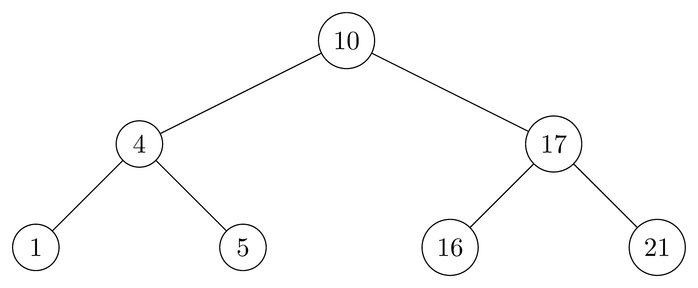
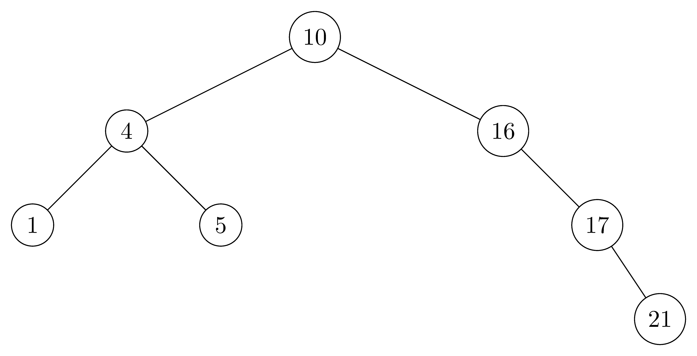
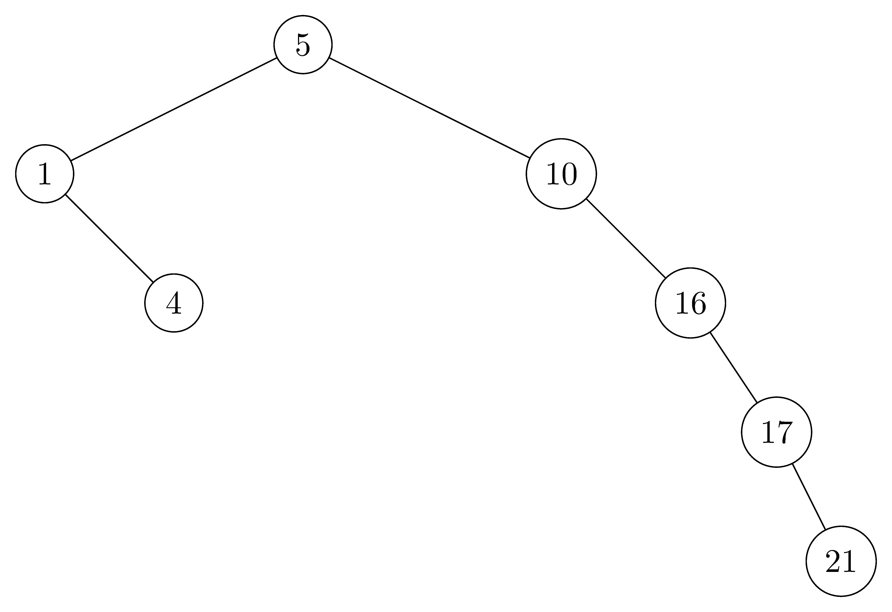
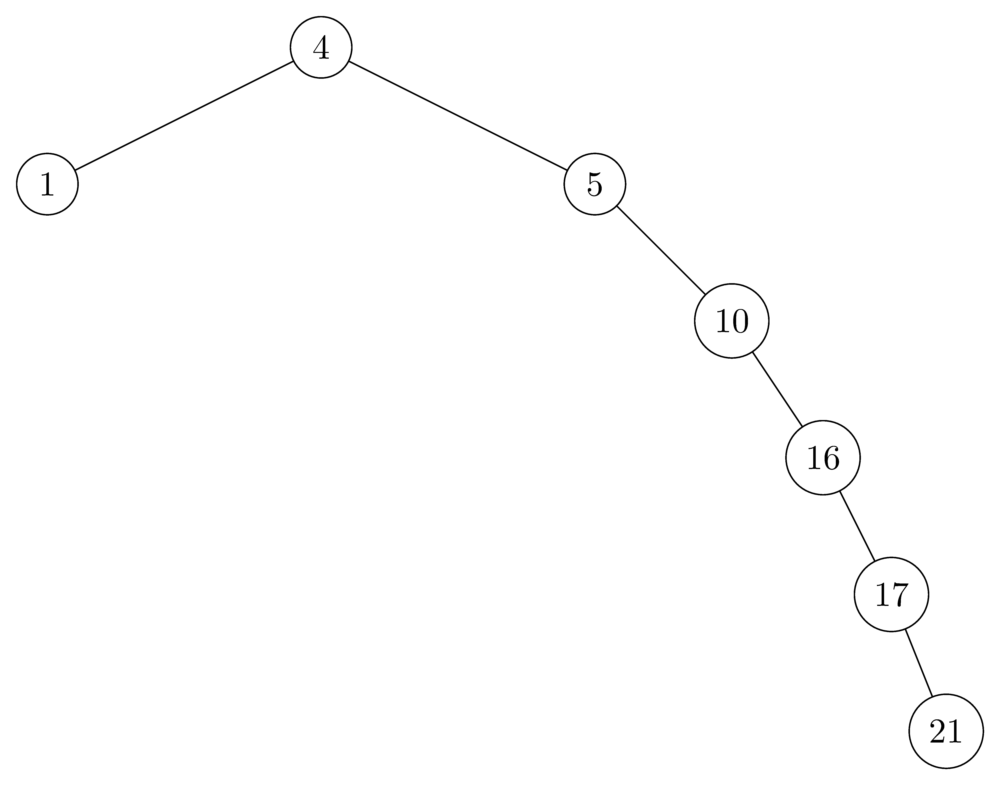
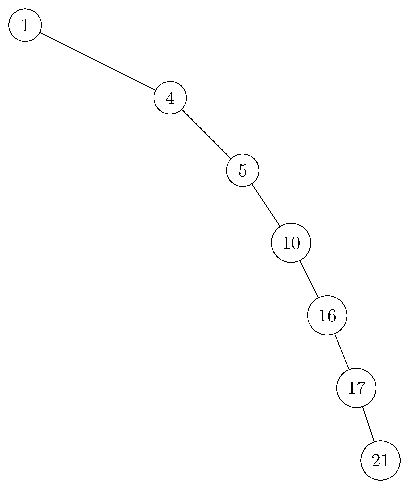

## 12.1-1

> Para o conjunto $\\{ 1, 4, 5, 10, 16, 17, 21 \\}$ de chaves, desenhe árvores binárias de busca com alturas $2$, $3$, $4$, $5$ e $6$.

- $altura = 2$:

  

- $altura = 3$:

  

- $altura = 4$:

  

- $altura = 5$:

  

- $altura = 6$:

  

## 12.1-2

> Qual é a diferença entre a propriedade de árvore binária de busca e a propriedade de heap mínimo na página 163? A propriedade de heap mínimo pode ser usada para imprimir as chaves de uma árvore de $n$ nós ordenadamente em $O(n)$? Mostre como, ou explique por que não.

- A propriedade de árvore binária de busca garante que todos os nós na subárvore esquerda são menores, e todos os nós na subárvore direita são maiores.
- A propriedade de heap mínimo apenas garante a relação geral de filho maior que pai, mas não distingue entre filhos esquerdos e direitos. Por esse motivo, a propriedade de heap mínimo não pode ser usada para imprimir as chaves ordenadamente em tempo linear, pois não temos como saber qual subárvore contém o próximo menor elemento.

## 12.1-3

> Dê um algoritmo não recursivo que percorre a árvore em ordem. ($\textit{Dica:}$ Uma solução fácil usa uma pilha como estrutura de dados auxiliar. Uma solução mais complicada, mas elegante, não usa uma pilha, mas assume que podemos testar dois ponteiros quanto à igualdade.)

```cpp
INORDER-TREE-WALK(T)
    let S be an empty stack
    current = T.root
    done = 0
    while !done
        if current != NIL
            PUSH(S, current)
            current = current.left
        else
            if !S.EMPTY()
                current = POP(S)
                print current
                current = current.right
            else done = 1
```

## 12.1-4

> Dê algoritmos recursivos que percorrem pré-ordem e pós-ordem uma árvore de $n$ nós em tempo $\Theta(n)$.

```cpp
PREORDER-TREE-WALK(x)
    if x != NIL
        print x.key
        PREORDER-TREE-WALK(x.left)
        PREORDER-TREE-WALK(x.right)
```

```cpp
POSTORDER-TREE-WALK(x)
    if x != NIL
        POSTORDER-TREE-WALK(x.left)
        POSTORDER-TREE-WALK(x.right)
        print x.key
```

## 12.1-5

> Argumente que, como ordenar $n$ elementos leva tempo $\Omega(n\lg n)$ no pior caso no modelo de comparação, qualquer algoritmo baseado em comparação para construir uma árvore binária de busca a partir de uma lista arbitrária de $n$ elementos leva tempo $\Omega(n\lg n)$ no pior caso.

Assuma, para efeito de contradição, que podemos construir a árvore binária de busca por algoritmo baseado em comparação usando menos de $\Omega(n\lg n)$ de tempo, já que o percurso em ordem da árvore é $\Theta(n)$, então podemos obter os elementos ordenados em menos de $\Omega(n\lg n)$ de tempo, o que contradiz o fato de que ordenar $n$ elementos leva tempo $\Omega(n\lg n)$ no pior caso.
