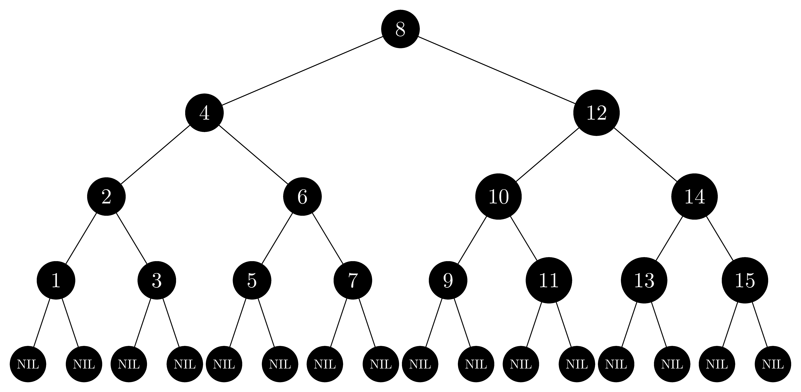

## 13.1-1

> Desenhe a árvore de busca binária completa de altura $3$ com as chaves de $1$ a $15$. Adicione as folhas $\text{NIL}$ e pinte a árvore de três modos diferentes, de tal modo que as alturas pretas das árvores rubro-negras resultantes sejam $2$, $3$ e $4$.

- Complete binary tree of $height = 3$:

  

- Red-black tree of $black\text-heights = 2$:

  

- Red-black tree of $black\text-heights = 3$:

  

- Red-black tree of $black\text-heights = 4$:

  

## 13.1-2

> Desenhe a árvore rubro-negra resultante da chamada a $\text{treeInsert}$ com chave $36$ na árvore da Figura 13.1. Se o nó inserido for vermelho, a árvore resultante é uma árvore rubro-negra? E se ele for preto?

- Se o nó inserido for vermelho, a árvore não satisfaz a propriedade 4 porque $35$ será o pai de $36$, que também é vermelho.
- Se o nó inserido for preto, a árvore não satisfaz a propriedade 5 porque haverá dois caminhos do nó $38$ a $T.nil$ que contêm números diferentes de nós pretos.

Não desenhamos a árvore rubro-negra _errada_; no entanto, desenhamos a árvore ajustada:

## 13.1-3

> Vamos definir uma **árvore rubro-negra relaxada** como uma árvore de busca binária que satisfaz as propriedades rubro-negras 1, 3, 4 e 5. Em outras palavras, a raiz pode ser vermelha ou preta. Considere uma árvore rubro-negra relaxada $T$ cuja raiz é vermelha. Se colorirmos a raiz de $T$ de preto, mas não fizermos nenhuma outra mudança em $T$, a árvore resultante é uma árvore rubro-negra?

Sim.

- A propriedade 1 é trivialmente satisfeita, pois apenas um nó é alterado e não é alterado para alguma terceira cor misteriosa.
- A propriedade 3 é trivialmente satisfeita, pois nenhuma nova folha é introduzida.
- A propriedade 4 é satisfeita, pois não foi introduzido nenhum nó vermelho.
- A propriedade 5 é satisfeita, pois os únicos caminhos nos quais alteraremos o número de nós pretos são aqueles provenientes da raiz. Todos eles aumentarão em $1$ sua altura, portanto, permanecerão com mesma altura.

## 13.1-4

> Suponha que "absorvamos" cada nó vermelho em uma árvore rubro-negra em seu pai preto, de modo que os filhos do nó vermelho se tornem filhos do pai preto. (Ignore o que acontece com as chaves.) Quais são os possíveis graus de um nó preto depois que todos os seus filhos vermelhos forem absorvidos? O que você pode dizer sobre as profundidades das folhas da árvore resultante?

Depois de absorver cada nó vermelho em seu pai preto, o grau de cada nó preto será:

- 2, se ambos os filhos eram pretos,
- 3, se um filho era preto e o outro vermelho, ou
- 4, se ambos os filhos eram pretos

Todas as folhas da árvore resultante permanecem tendo a mesma profundidade, que poderia ser reduzida até pela metade.

## 13.1-5

> Mostre que o comprimento do mais longo caminho simples de um nó $x$ em uma árvore rubro-negra até uma folha descendente é, no máximo, duas vezes o do caminho simples mais curto do nó $x$ até uma folha descendente.

Suponha que temos o caminho simples mais longo $(a_1, a_2, \dots, a_s)$ e o caminho simples mais curto $(b_1, b_2, \dots, b_t)$. Então, pela Propriedade 5, sabemos que eles têm o mesmo número de nós pretos. Pela Propriedade 4, sabemos que nenhum deles contém um nó vermelho repetido. Isso nos diz que no máximo $\left\lfloor \frac{s - 1}{2} \right\rfloor$ dos nós no caminho mais longo são vermelhos. Isso significa que pelo menos $\left\lceil \frac{s + 1}{2} \right\rceil$ são pretos, então $t \ge \left\lceil \frac{s + 1}{2} \right\rceil$, senão a propriedade 5 seria quebrada. Portanto, se, por absurdo, tivéssemos que $s > t \cdot 2$, então $t \ge \left\lceil \frac{s + 1}{2} \right\rceil \ge \left\lceil \frac{2t + 2}{2} \right\rceil = t + 1$ resultaria em uma contradição.

## 13.1-6

> Qual é a maior quantidade possível de nós internos em uma árvore rubro-negra com altura-preta $k$? Qual é a menor quantidade possível?

Numa árvore binária completa, a quantidade de nós em um nível é o dobro do nível anterior, começando do primeiro nível que tem só 1 nó. Isto é, pela fórmula da soma dos termos de uma PG, a quantidade de nós de uma árvore binária completa com altura $h$ é $2^{h+1}-1$, sendo $h+1$ a quantidade de níveis (o primeiro nível possui altura zero).

A maior quantidade possível de nós internos em uma árvore rubro-negra com altura-preta $k$ se dá quando temos o máximo possível de nós vermelhos em uma árvore completa, isto é, o caminho da raiz até as folhas é intercalado entre nós vermelhos e pretos, ou $2k=h$. Logo, a maior quantidade é $2^{2k+1}-1$.

A menor quantidade possível se dá quando todos os nós são pretos, o que só é possível em uma árvore completa, isto é, $k=h$. Logo, a menor quantidade é $2^{k+1}-1$.

## 13.1-7

> Considere uma árvore rubro-negra com $n$ nós. Como seria a árvore com a maior razão possível entre nós internos vermelhos e nós internos pretos. Qual é essa razão? Como seria a árvore com a menor razão possível e qual é essa razão?

- A maior razão é $2$, cada nó preto tem dois filhos vermelhos.
- A menor razão é $0$.