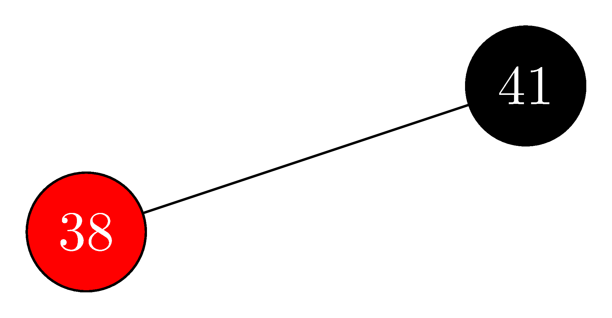
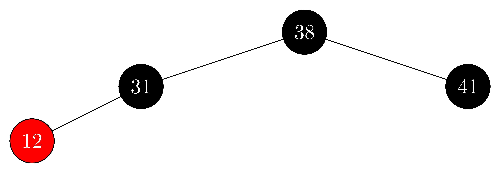
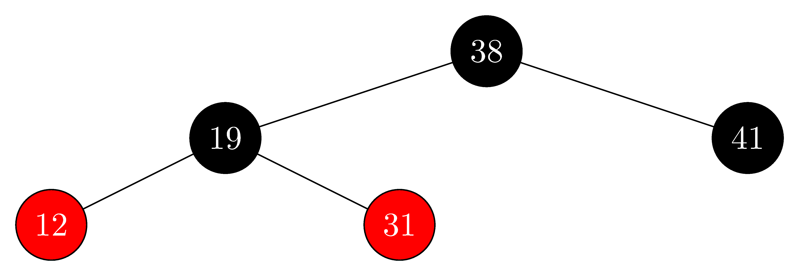

## 13.3-1

> Na linha 16 de RBInsert, colorimos o nó z recém-inserido de vermelho. Note que, se tivéssemos colorido de preto, a propriedade 4 de uma árvore rubro-negra não seria violada. Por que não optamos por colorir z de preto?

Se escolhermos colorir z de preto, então estaríamos violando a propriedade 5 da árvore rubro-negra.

## 13.3-2

> Mostre as árvores rubro-negras que resultam após a inserção sucessiva das chaves 41, 38, 31, 12, 19, 8 em uma árvore rubro-negra inicialmente vazia.

- insert $41$:

  

- insert $38$:

  

- insert $31$:

  

- insert $12$:

  

- insert $19$:

  

- insert $8$:

  

## 13.3-3

> Suponha que a altura-preta de cada uma das subárvores $\alpha$, $β$, $γ$, $δ$ e $ε$, nas Figuras 13.5 e 13.6 seja $k$. Identifique cada nó em cada figura com sua altura-preta para verificar se a transformação indicada preserva a propriedade 5.

Primeiramente, como vimos, o algoritmo de inserção mantém a propriedade de altura-preta, isto é, para qualquer subárvore, a distância até qualquer folha possui a mesma quantidade de nós pretos.

Nas árvores à esquerda da Figura 13.5, como $A$, $B$ e $D$ são vermelhos, sabemos que as raízes das subárvores de seus filhos são pretas. Como estas subárvores possuem altura-preta $k$, então, $A$, $B$, $C$ e $D$ possuem altura-preta $k+1$. Depois da coloração, nas árvores à direita, o primeiro nó preto abaixo de $A$, $B$ e $D$ continua sendo a raiz das subárvores, logo, suas alturas-pretas continuam sendo $k+1$. Já a altura-preta de $C$ passa a ser $k+2$, pois agora descendo até as folhas, $C$ passa por $A$ ou $D$, que são pretos. A altura-preta do pai de $C$ era $k+2$, e depois da coloração, continuou sendo $k+2$, logo, a altura-preta da árvore inteira não foi alterada, a não ser que $C$ seja a raiz, no caso, a altura-preta da árvore passa a ser de $k+1$ para $k+2$.

Nas árvores à esquerda e do meio da Figura 13.6, como $A$ e $B$ são vermelhos, sabemos que as raízes das subárvores de seus filhos são pretas. Logo, $A$ e $B$ possui altura-preta $k+1$. Já $C$, como seu filho $γ$ também possui altura-preta $k$, então sua altura-preta é $k+1$. Depois da rotação e coloração, na árvore à direita, $A$, $B$ e $C$ continuam tendo altura-preta $k+1$, pois nenhum de seus filhos foi colorido de preto. A altura-preta do pai de $C$ era $k+2$, e depois da coloração e rotação, o então pai de $B$ continuou sendo $k+2$, logo, a altura-preta da árvore inteira não foi alterada.

## 13.3-4

> O professor Teach está preocupado que RBInsertFixup possa atribuir VERMELHO a T.nil.color, caso em que o teste da linha 1 não faria o laço terminar quando z fosse a raiz. Mostre que a preocupação do professor é infundada, demonstrando que RBInsertFixup nunca colore T.nil de vermelho.

Observe que no código de RBInsertFIXUP, em nenhum momento algum filho é colorido de vermelho, logo, não passamos pelo risco de colorir uma folha T.nil de vermelho. Precisamos apenas verificar se quando colorimos o avô de vermelho, ele não é a raiz.

O while da linha 1 garante que só coloriremos o avô quando o pai for vermelho. Mas se o pai é vermelho, necessariamente ele não é a raiz, então o avô não tem como ser T.nil, pois só a raiz possui pai T.nil.

## 13.3-5

> Considere uma árvore rubro-negra formada pela inserção de n nós com RBInsert. Mostre que, se n > 1, a árvore tem, no mínimo, um nó vermelho.

Como vimos no algoritmo RBInsertFIXUP, só há três casos possível ao inserir um nó z vermelho. Ao final do caso 1, o nó inserido continua vermelho. Ao final do caso 2, tanto z quanto seu pai continuam vermelhos. Ao final do caso 3, z continua vermelho. Isto é, nunca colorimos o nó atual, que é vermelho, de preto.

## 13.3-6

> Sugira como implementar RBInsert de maneira eficiente se a representação para árvores rubro-negras não incluir referência ao pai.

Alternativa 1: RBInsert seria recursivo, e cada chamada teria uma referência ao filho e neto, e o FIXUP seria nele próprio.

Alternativa 2: Usar pilha. Em RBInsert, empilhe cada y no caminho até z. Assim, o pai de z é o nó do topo da pilha.

- **Caso 1:** desempilhamos $z.p$ e $z.p.p$.
- **Caso 2:** desempilhamos $z.p$ e $z.p.p$, depois empilhamos $z.p.p$ e $z$.
- **Caso 3:** desempilhamos $z.p$, $z.p.p$ e $z.p.p.p$, depois empilhamos $z.p$.
