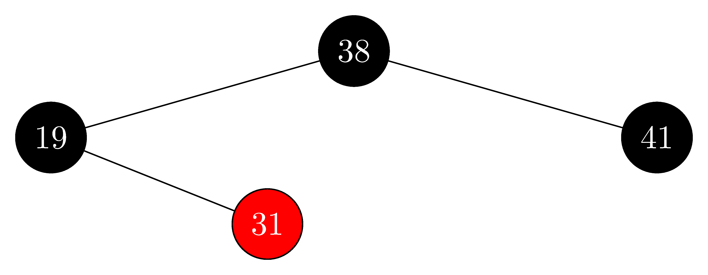

## 13.4-1

> Mostre que, após a execução de $\text{RBDeleteFixup}$, a raiz da árvore tem de ser preta.

Vamos olhar para as alterações nas cores dos ancestrais de $x$.

- O caso 1 colore $x.p$ de vermelho e $w$ de preto, entretanto, $x.p$ é rotacionado em direção a $x$, promovendo $w$. Logo, como $w$ está acima de $x$ e é preto, é garantido que a raiz não é vermelha.
- Os casos 2 e 3 não colorem nenhum ancestral de $x$.
- O caso 4 colore $w$ da cor de $x.p$, que pode ser vermelho, e rotaciona $x.p$ em direção à $x$, promovendo $w$. Supondo que $w$ seja a raiz e vermelho, como do caso 4 o loop se encerra, e a última linha colore a raiz de preto, então é garantido que a raiz é preta.

## 13.4-2

> Mostre que, se $x$ e $x.p$ são vermelhos em RBDelete, então a propriedade 4 é restabelecida pela chamada a $\text{RBDeleteFixup(T, x)}$.

O nó $x$ toma o lugar de $y$. Se $x$ era vermelho, $y$ necessariamente era preto. Se o pai de $y$ era vermelho, agora temos dois vermelhos seguidos. Essa violação é corrigida na última linha de $\text{RBDeleteFixup}$.

## 13.4-3

> No Exercício 13.3-2, você determinou a árvore rubro-negra resultante da inserção sucessiva das chaves $41, 38, 31, 12, 19, 8$ em uma árvore inicialmente vazia. Agora, mostre as árvores rubro-negras resultantes da exclusão sucessiva das chaves na ordem $8, 12, 19, 31, 38, 41$.

- initial:

    

- delete $8$:

    

- delete $12$:

    

- delete $19$:

    

- delete $31$:

    

- delete $38$:

    

- delete $41$:

    

## 13.4-4

> Em quais linhas de código de $\text{RBDeleteFixup}$ poderíamos examinar ou modificar a sentinela $T.nil$?

Quando $y$ não tem filhos, $x=T.nil$, portanto, as linhas 1 e 2 de fixup podem examinar a sentinela.

Quando a raiz é excluída, $x=T.nil$ toma seu lugar. Neste caso, a última linha de fixup pode colorir a sentinela de preto, apesar de já ser preta.

## 13.4-5

> Em cada um dos casos da Figura 13.7, dê a contagem de nós pretos da raiz da subárvore mostrada até cada uma das subárvores $\alpha , β, γ, δ, ε, ζ$, e confirme que cada contagem permanece a mesma depois da transformação. Quando um nó tiver um atributo cor $c$ ou $c'$, use a notação $\text{count}(c)$ ou $\text{count}(c')$ simbolicamente em sua contagem.

- **Caso 1:** Para cada subárvore, é $2$ tanto antes quanto depois.

- **Caso 2:**

    - Para $\alpha$ and $\beta$, é $1 + \text{count}\(c\)$ tanto antes quanto depois.
    - Para as demais, vai de $2 + \text{count}\(c\)$ para $1 + \text{count}\(c\)$.

    As demais subárvores diminuem sua altura-preta em 1, ou seja, agora, todas as subárvores têm uma altura-preta a menos. Isso é corrigido considerando $B$ como o novo $x$.

- **Caso 3:**

    - Para $\epsilon$ e $\zeta$, é $2+\text{count}\(c\)$ tanto antes quanto depois.
    - Para as demais, é $1+\text{count}\(c\)$ tanto antes quanto depois.

- **Case 4:**

    - Para $\alpha$ e $\beta$, vai de $1 + \text{count}\(c\)$ para $2 + \text{count}\(c\)$.
    - Para $\gamma$ e $\delta$, é $1 + \text{count}\(c\) + \text{count}(c')$ tanto antes quanto depois.
    - Para $\epsilon$ e $\zeta$, é $1 + \text{count}\(c\)$ tanto antes quanto depois.

    As subárvores que tinham uma altura-preta a menos agora possuem a mesma altura preta que as demais, corrigindo, assim, a altura-preta da árvore.

## 13.4-6

> Os professores Skelton e Baron estão preocupados porque, no início do caso 1 de $RBDeleteFixup$, o nó $x.p$ poderia não ser preto. Se os professores estão corretos, as linhas 5-6 estão erradas. Mostre que $x.p$ deve ser preto no início do caso 1 e, portanto, os professores não precisam se preocupar.

No caso 1, o irmão $w$ de $x$ é vermelho. Neste caso, seu pai não pode ser vermelho, senão a propriedade 4 estaria violada.

## 13.4-7

> Suponha que um nó $x$ seja inserido em uma árvore rubro-negra com $RBInsert$ e então imediatamente excluído com $RBDelete$. A árvore rubro-negra resultante é igual à árvore rubro-negra inicial? Justifique sua resposta.

No, the red-black tree will not necessarily be the same.

- Example 1:

    - initial:

        

    - insert $1$:

        

    - delete $1$:

        

- Example 2:

    - initial:

        

    - insert $1$:

        

    - delete $1$:

        
