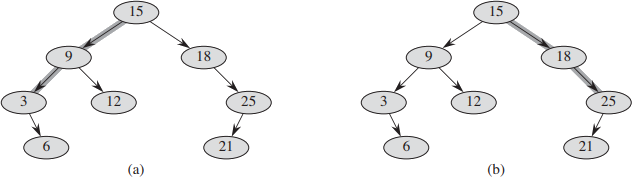

> Se inserirmos um conjunto de $n$ itens em uma árvore de busca binária, a árvore resultante pode ficar terrivelmente desbalanceada, levando a longos tempos de busca. Como vimos na Seção 12.4, no entanto, as árvores de busca binárias construídas aleatoriamente tendem a ser balanceadas. Portanto, uma estratégia que, em média, constrói uma árvore balanceada para um conjunto fixo de itens seria permutar aleatoriamente os itens e depois inseri-los nessa ordem na árvore.
>
> E se não tivermos todos os itens de uma vez? Se recebermos os itens um de cada vez, ainda podemos construir aleatoriamente uma árvore de busca binária a partir deles?
>
> Examinaremos uma estrutura de dados que responde afirmativamente a essa pergunta. Uma **_treap_** é uma árvore de busca binária com uma maneira modificada de ordenar os nós. A Figura 13.9 mostra um exemplo.

```
        ____G:04____
   _B:07_           H:05_
A:10    E:23           _K:65
                    I:73
```
> (Figura 13.9 Uma treap. Cada nó $x$ é rotulado com $x.key$:$x.priority$. Por exemplo, a raiz tem chave $G$ e prioridade $4$.)

> Como de costume, cada nó $x$ na árvore tem um valor de chave $x.key$. Além disso, atribuímos $x.priority$, que é um número aleatório escolhido independentemente para cada nó. Assumimos que todas as prioridades são distintas e também que todas as chaves são distintas. Os nós da treap são ordenados de modo que as chaves obedeçam à propriedade binary-search-tree e as prioridades obedeçam à propriedade min-heap:
>
> - Se $v$ é filho esquerdo de $u$, então $v.key < u.key$.
> - Se $v$ é filho direito de $u$, então $v.key > u.key$.
> - Se $v$ é filho de $u$, então $v.priority > u.priority$.
>
> (Essa combinação de propriedades é o motivo pelo qual a árvore é chamada de "treap": ela possui características tanto de uma árvore de pesquisa binária quanto de um heap.)
>
> Pense em treaps da seguinte maneira. Suponha que inserimos nós $x_1, x_2, \ldots, x_n$, com chaves associadas, em uma treap. Então a treap resultante é a árvore que teria sido formada se os nós tivessem sido inseridos em uma árvore de busca binária normal na ordem dada por suas prioridades (escolhidas aleatoriamente), ou seja, $x_i.priority < x_j.priority$ significa que inserimos $x_i$ antes de $x_j$.

> **a.** Mostre que dado um conjunto de nós $x_1, x_2, \ldots, x_n$, com chaves e prioridades associadas, todas distintas, a treap associada a esses nós é única.

A raiz é o nó com menor prioridade. A raiz divide o conjunto em dois subconjuntos com base na chave. Em cada subconjunto, o nó com menor prioridade é selecionado como a raiz, assim podemos determinar de forma única uma treap com uma entrada específica.

> **b.** Mostre que a altura esperada de uma treap é $\Theta(\lg n)$ e, portanto, o tempo esperado para procurar um valor na treap é $\Theta(\lg n)$.

Devido à prioridade dos nós, cada permutação corresponde exatamente a uma treap, ou seja, todos os nós formam uma BST em prioridade. Já que a prioridade de todos os nós é aleatória, treap é, essencialmente, uma árvore de busca binária construída aleatoriamente. Portanto, a altura esperada de uma treap é $\Theta(\lg n)$.

> Vejamos como inserir um novo nó em uma treap existente. A primeira coisa que fazemos é atribuir ao novo nó uma prioridade aleatória. Em seguida, chamamos o algoritmo de inserção $\text{TREAP-INSERT}$, cuja operação é ilustrada na Figura 13.10.


> Figura 13.10 A operação de $\text{TREAP-INSERT}$. (a) A treap original, antes da inserção. (b) A treap após inserir um nó com chave $C$ e prioridade $25$. (c)–(d) Estágios intermediários ao inserir um nó com chave $D$ e prioridade $9$. (e) A treap após a inserção das partes (c) e (d) é finalizada. (f) A treap após inserir um nó com chave $F$ e prioridade $2$.

> **c.** Explique como $\text{TREAP-INSERT}$ funciona. Explique a ideia em português e dê pseudocódigo. ($\textit{Dica:}$ Execute o procedimento normal de inserção da árvore binária de pesquisa e, em seguida, execute as rotações para restaurar a propriedade min-heap.)

Primeiro insira um nó como de costume usando o procedimento de inserção de árvore de busca binária. Em seguida, execute rotações para a esquerda e para a direita até que o pai do nó inserido não tenha maior prioridade.

> **d.** Mostre que o tempo de execução esperado de $\text{TREAP-INSERT}$ é $\Theta(\lg n)$.

A rotação custa $\Theta(1)$, ocorrem no máximo $h$ rotações, portanto o tempo de execução esperado é $\Theta(\lg n)$.

> $\text{TREAP-INSERT}$ realiza uma busca e depois uma sequência de rotações. Embora essas duas operações tenham o mesmo tempo de execução esperado, elas têm custos diferentes na prática. Uma busca lê as informações da treap sem modificá-las. Em contraste, uma rotação altera os ponteiros pai e filho dentro da treap. Na maioria dos computadores, as operações de leitura são muito mais rápidas do que as operações de escrita. Assim, gostaríamos que $\text{TREAP-INSERT}$ realizasse poucas rotações. Mostraremos que o número esperado de rotações realizadas é limitado por uma constante.

> Para isso, precisaremos de algumas definições, que a Figura 13.11 apresenta.



> Figura 13.11 Espinhas de uma árvore de busca binária. A espinha esquerda está sombreada em (a), e a espinha direita está sombreada em (b).

> A **_espinha esquerda_** de uma árvore de busca binária $T$ é o caminho simples da raiz até o nó com a menor chave. Simetricamente, a **_espinha direita_** de $T$ é o caminho simples desde a raiz que consiste apenas em arestas direitas. O **_comprimento_** de uma espinha é o número de nós que ela contém.
>
> **e.** Considere a treap $T$ imediatamente após $\text{TREAP-INSERT}$ ter inserido o nó $x$. Seja $C$ o comprimento da espinha direita da subárvore esquerda de $x$. Seja $D$ o comprimento da espinha esquerda da subárvore direita de $x$. Prove que o número total de rotações realizadas durante a inserção de $x$ é igual a $C + D$.

A rotação à esquerda aumenta $C$ em $1$, a rotação à direita aumenta $D$ em $1$.

> Vamos agora calcular os valores esperados de $C$ e $D$. Sem perda de generalidade, assumimos que as chaves são $1, 2, \ldots, n$, pois as comparamos apenas entre si.
>
> Para os nós $x$ e $y$ na treap $T$, onde $y \ne x$, seja $k = x.key$ e $i = y.key$. Definimos variáveis aleatórias indicadoras
>
> $$X\_{ik} = I\\{y \text{ está na espinha direita da subárvore esquerda de } x \\}$$.
>
> **f.** Mostre que $X_{ik} = 1$ se e somente se $y.priority \gt x.priority$, $y.key \lt x.key$, e, para todo $z$ tal que $y.key \lt z.key \lt x.key$, temos $y.priority \lt z.priority$.

Os dois primeiros são óbvios.

A propriedade min-heap não será válida se $y.priority \gt z.priority$.

> **g.** Mostre que
>
> $$
> \begin{aligned}
> \Pr\\{X_{ik} = 1\\}
> & = \frac{(k - i - 1)!}{(k - i + 1)!} \\\\
> & = \frac{1}{(k - i + 1)(k - i)}. \\\\
> \end{aligned}
> $$

$$\Pr\\{X_{ik} = 1\\} = \frac{(k - i - 1)!}{(k - i + 1)!} = \frac{1}{(k - i + 1)(k - i)}.$$

> **h.** Mostre que
>
> $$
> \begin{aligned}
> \text E[C] & = \sum_{j = 1}^{k - 1} \frac{1}{j(j + 1)} \\\\
> & = 1 - \frac{1}{k}.
> \end{aligned}
> $$

$$
\begin{aligned}
\text E[C] & = \sum_{j = 1}^{k - 1} \frac{1}{(k - i + 1)(k - i)} \\\\
            & = \sum_{j = 1}^{k - 1} (\frac{1}{k - i} - \frac{1}{k - i + 1}) \\\\
            & = 1 - \frac{1}{k}.
\end{aligned}
$$

> **i.** Use um argumento de simetria para mostrar que
>
> $$\text E[D] = 1 - \frac{1}{n - k + 1}.$$

$$
\begin{aligned}
\text E[D] & = \sum_{j = 1}^{n - k} \frac{1}{(k - i + 1)(k - i)} \\\\
            & = 1 - \frac{1}{n - k + 1}.
\end{aligned}
$$

> **j.** Conclui que o número esperado de rotações executadas ao inserir um nó em uma treap é menor que $2$.

Pela parte (e), o número de rotações é $C + D$. Pela linearidade da expectativa, $\text E[C + D] = 2 - \frac{1}{k} - \frac{1}{n - k + 1} \le 2$ para qualquer escolha de $k$.